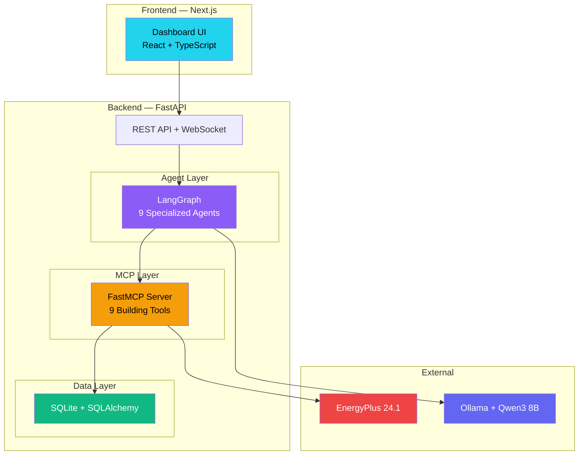
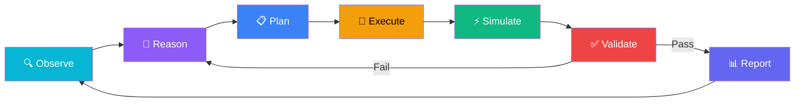
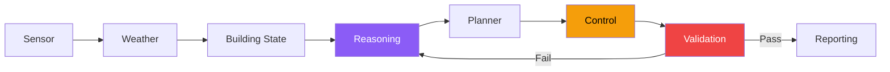

<p align="center">
  <h1 align="center">🏢 Eco-Loop Building Agents</h1>
  <p align="center">
    <strong>Autonomous Closed-Loop Building Optimization with AI Agents</strong>
  </p>
  <p align="center">
    EnergyPlus • LangGraph • MCP • Qwen3 8B • FastAPI • Next.js
  </p>
</p>

<p align="center">
  
  
  
  
  
</p>

---

> **Implementation status: Phase 1 complete** (see `phases.md`). Backend
> (FastAPI + SQLite + SQLAlchemy) and frontend (Next.js + TS + Tailwind)
> are runnable now, using mock EnergyPlus/Ollama/LangGraph/FastMCP services
> behind the same interfaces the real integrations will use later
> (`USE_MOCK_ENERGYPLUS` / `USE_MOCK_LLM` in `.env`).

## 🚀 Quick Start (Phase 1)

**Backend**
```bash
cd backend
python -m venv venv && source venv/bin/activate   # Windows: venv\Scripts\activate
pip install -r requirements.txt
uvicorn app.main:app --reload
```
Runs at `http://localhost:8000` (Swagger docs at `/docs`). `backend/.env`
already ships with both mock flags on — nothing external to install.

**Frontend**
```bash
cd frontend
npm install
npm run dev
```
Runs at `http://localhost:3000`, proxying `/api/*` to the backend.

---

## 📋 Table of Contents

- [Overview](#-overview)
- [Problem Statement](#-problem-statement)
- [Architecture](#-architecture)
- [Tech Stack](#-tech-stack)
- [Folder Structure](#-folder-structure)
- [Prerequisites](#-prerequisites)
- [Installation](#-installation)
- [EnergyPlus Setup](#-energyplus-setup)
- [Ollama Setup](#-ollama-setup)
- [Database](#-database)
- [MCP Tools](#-mcp-tools)
- [LangGraph Agents](#-langgraph-agents)
- [Dashboard](#-dashboard)
- [API Reference](#-api-reference)
- [Closed-Loop Flow](#-closed-loop-flow)
- [Development Roadmap](#-development-roadmap)
- [Future Work](#-future-work)
- [License](#-license)

---

## 🌍 Overview

**Eco-Loop Building Agents** is an autonomous closed-loop building energy optimization system that combines:

- **EnergyPlus 24.1** — DOE's gold-standard building energy simulation engine
- **Qwen3 8B Instruct** — Open-source LLM running locally via Ollama
- **LangGraph** — Multi-agent orchestration framework
- **FastMCP** — Model Context Protocol for standardized tool calling
- **Next.js Dashboard** — Enterprise-grade real-time monitoring

The system continuously **observes** building conditions, **reasons** about inefficiencies, **plans** optimizations, **executes** changes through MCP tools, **simulates** outcomes via EnergyPlus, **validates** safety, and **repeats** — all autonomously without human intervention.

---

## 🎯 Problem Statement

> **Build an autonomous closed-loop building optimization system using EnergyPlus, an open-source LLM, MCP tool calling, and AI reasoning.**

Buildings consume **40% of global energy**. Most building management systems (BMS) use simple rule-based controls that can't adapt to changing conditions. Eco-Loop demonstrates how AI agents can:

1. **Reduce energy consumption** by 15-30% through intelligent setpoint optimization
2. **Maintain occupant comfort** within ASHRAE 55 standards
3. **Lower carbon emissions** proportionally to energy savings
4. **Operate autonomously** without human intervention
5. **Run completely offline** using a local open-source LLM

---

## 🏗️ Architecture

### High-Level System Architecture



### Closed-Loop Flow



📖 **Detailed architecture docs**: [docs/architecture.md](docs/architecture.md)

---

## 🛠️ Tech Stack

| Layer | Technology | Purpose |
|---|---|---|
| **Backend** | Python 3.11+ / FastAPI | REST API, WebSocket, async processing |
| **Frontend** | Next.js 14 / React 18 / TypeScript | Dashboard UI |
| **Styling** | TailwindCSS / shadcn/ui | Enterprise dark theme with glassmorphism |
| **Charts** | Recharts | Interactive data visualizations |
| **Animations** | Framer Motion | Smooth transitions and micro-animations |
| **Database** | SQLite / SQLAlchemy / Alembic | Persistent storage with migrations |
| **Simulation** | EnergyPlus 24.1 / eppy | Building energy simulation |
| **LLM** | Qwen3 8B Instruct / Ollama | Local AI reasoning |
| **Agents** | LangGraph | Multi-agent orchestration |
| **MCP** | FastMCP / langchain-mcp-adapters | Standardized tool interface |
| **Containers** | Docker / Docker Compose | Reproducible environment |
| **CI** | GitHub Actions | Automated testing |

### Why Qwen3 8B Instruct?

| Criterion | Detail |
|---|---|
| **Quality** | Best-in-class at 8B scale — outperforms Llama 3.1 8B on reasoning benchmarks |
| **Tool Calling** | Native function calling support via Ollama |
| **Latency** | ~3s per response on RTX 3060 |
| **Memory** | ~5GB VRAM (GPU) or ~8GB RAM (CPU) |
| **License** | Apache 2.0 — fully permissive |
| **Offline** | Runs 100% locally via Ollama — no API keys needed |

📖 **Detailed justification**: [docs/llm.md](docs/llm.md)

---

## 📁 Folder Structure

```
AI-Agent/
├── backend/                    # Python FastAPI backend
│   ├── app/
│   │   ├── main.py             # FastAPI entrypoint
│   │   ├── config.py           # Settings management
│   │   ├── database.py         # SQLAlchemy setup
│   │   ├── api/routes/         # REST API endpoints
│   │   ├── models/             # SQLAlchemy ORM models
│   │   ├── schemas/            # Pydantic validation schemas
│   │   ├── services/           # Business logic
│   │   ├── agents/             # LangGraph agent definitions
│   │   ├── mcp/                # FastMCP server & tools
│   │   └── core/               # Logging, exceptions
│   ├── alembic/                # Database migrations
│   ├── tests/                  # Backend tests
│   └── requirements.txt
├── frontend/                   # Next.js dashboard
│   ├── src/
│   │   ├── app/                # Next.js App Router pages
│   │   ├── components/         # React components
│   │   ├── lib/                # API client, utilities
│   │   ├── hooks/              # Custom React hooks
│   │   └── types/              # TypeScript definitions
│   └── package.json
├── energyplus/                 # Simulation files
│   ├── models/                 # IDF building models
│   └── weather/                # EPW weather files
├── docs/                       # Documentation
│   ├── architecture.md         # System architecture
│   ├── energyplus.md           # EnergyPlus deep-dive
│   ├── database.md             # Database schema & ER diagram
│   ├── mcp.md                  # MCP tools & integration
│   ├── agents.md               # Agent graph & prompts
│   ├── dashboard.md            # Dashboard design & wireframes
│   ├── llm.md                  # LLM selection & setup
│   ├── closed-loop.md          # Closed-loop flow
│   └── api.md                  # API reference
├── docker/                     # Docker configuration
├── .github/workflows/          # CI/CD
├── .env.example                # Environment template
├── .gitignore
├── LICENSE
└── README.md
```

---

## 📦 Prerequisites

Before installation, ensure you have:

| Software | Version | Purpose | Installation |
|---|---|---|---|
| Python | 3.11+ | Backend runtime | [python.org](https://python.org) |
| Node.js | 20+ | Frontend runtime | [nodejs.org](https://nodejs.org) |
| EnergyPlus | 24.1.0 | Building simulation | [energyplus.net](https://energyplus.net) |
| Ollama | Latest | Local LLM runtime | [ollama.com](https://ollama.com) |
| Git | Latest | Version control | [git-scm.com](https://git-scm.com) |
| Docker | Latest (optional) | Containerization | [docker.com](https://docker.com) |

---

## 🚀 Installation

### 1. Clone the Repository

```bash
git clone https://github.com/your-username/AI-Agent.git
cd AI-Agent
```

### 2. Backend Setup

```bash
cd backend
python -m venv venv
# Windows:
venv\Scripts\activate
# Linux/macOS:
source venv/bin/activate

pip install -r requirements.txt
```

### 3. Frontend Setup

```bash
cd frontend
npm install
```

### 4. Environment Configuration

```bash
cp .env.example .env
# Edit .env with your local paths
```

### 5. Database Initialization

```bash
cd backend
alembic upgrade head
```

---

## ⚡ EnergyPlus Setup

### Installation

1. Download EnergyPlus 24.1.0 from [energyplus.net/downloads](https://energyplus.net/downloads)
2. Run the installer (default: `C:\EnergyPlusV24-1-0\` on Windows)
3. Add to your system PATH
4. Verify: `energyplus --version`

### Building Model

We use the **DOE Small Office Reference Building** (`RefBldgSmallOfficeNew2004_Chicago.idf`):
- 511 m² single-story office with 5 thermal zones
- Packaged HVAC system (PSZ-AC)
- Standard occupancy and lighting schedules
- Located in `energyplus/models/`

### Weather File

We use the **Chicago TMY3** weather file:
- `USA_IL_Chicago-OHare.Intl.AP.725300_TMY3.epw`
- 8,760 hours of typical meteorological year data
- Located in `energyplus/weather/`
- Change weather by replacing the EPW file and updating `.env`

### Why No FMU?

FMU (Functional Mock-up Unit) is for real-time co-simulation. Our approach uses sequential batch simulation (modify IDF → run → read outputs → repeat), which is simpler and sufficient for AI-driven optimization.

📖 **Full details**: [docs/energyplus.md](docs/energyplus.md)

---

## 🤖 Ollama Setup

### Installation

```bash
# Download from https://ollama.com/download
# Run the installer

# Verify:
ollama --version
```

### Download Qwen3 8B

```bash
ollama pull qwen3:8b

# Verify:
ollama list
# Should show: qwen3:8b

# Test:
ollama run qwen3:8b "What is building energy optimization?"
```

### Resource Requirements

| Resource | Minimum | Recommended |
|---|---|---|
| RAM | 8 GB | 16 GB |
| VRAM | 5 GB | 8 GB |
| Disk | 5 GB | 10 GB |

📖 **Full details**: [docs/llm.md](docs/llm.md)

---

## 🗄️ Database

SQLite database with 8 tables:

| Table | Purpose |
|---|---|
| `simulations` | Simulation run history |
| `sensor_readings` | Zone sensor data |
| `weather` | Weather conditions |
| `hvac_actions` | HVAC control changes |
| `optimization_metrics` | Post-optimization metrics |
| `baseline_metrics` | Baseline comparison data |
| `llm_reasoning` | Agent reasoning logs |
| `reports` | Generated reports |

📖 **Schema & ER diagram**: [docs/database.md](docs/database.md)

---

## 🔧 MCP Tools

9 tools exposed via FastMCP:

| Tool | Purpose |
|---|---|
| `read_building_state` | Get zone temperatures, humidity, occupancy |
| `read_weather` | Get outdoor weather conditions |
| `run_simulation` | Execute EnergyPlus simulation |
| `update_hvac` | Modify HVAC setpoints and mode |
| `update_lighting` | Adjust lighting levels |
| `update_setpoints` | Batch update setpoints |
| `analyze_comfort` | Calculate PMV/PPD comfort indices |
| `generate_report` | Create optimization reports |
| `get_historical_metrics` | Query historical data |

📖 **Full tool docs**: [docs/mcp.md](docs/mcp.md)

---

## 🤖 LangGraph Agents

9 specialized agents orchestrated by LangGraph:



📖 **Agent prompts & architecture**: [docs/agents.md](docs/agents.md)

---

## 📊 Dashboard

Enterprise-grade monitoring dashboard inspired by Datadog, Grafana, and Tesla Energy.

**Features**:
- Dark theme with glassmorphism (`#0F172A` background)
- Real-time metrics via WebSocket
- Energy, comfort, HVAC, weather, carbon visualizations
- AI reasoning panel with tool call visibility
- Decision timeline
- Historical trend analysis
- Sensor data table

📖 **Design spec**: [docs/dashboard.md](docs/dashboard.md)

---

## 📡 API Reference

| Method | Endpoint | Description |
|---|---|---|
| `GET` | `/api/v1/system/health` | Health check |
| `GET` | `/api/v1/system/status` | Component status |
| `GET` | `/api/v1/building/state` | Current building state |
| `GET` | `/api/v1/sensors/` | Sensor readings |
| `GET` | `/api/v1/weather/current` | Weather conditions |
| `POST` | `/api/v1/simulation/run` | Run simulation |
| `GET` | `/api/v1/energy/metrics` | Energy metrics |
| `GET` | `/api/v1/comfort/metrics` | Comfort metrics |
| `POST` | `/api/v1/agents/run-cycle` | Trigger optimization |
| `GET` | `/api/v1/agents/reasoning` | Agent reasoning logs |
| `GET` | `/api/v1/reports/` | Reports |
| `WS` | `/api/v1/ws/live` | Real-time updates |

Full API documentation available at `http://localhost:8000/docs` after starting the backend.

📖 **Full API spec**: [docs/api.md](docs/api.md)

---

## 🔄 Closed-Loop Flow

```
Observe → Read Sensors → Reason → Plan → Execute MCP Tools →
Modify Building → Run EnergyPlus → Collect Metrics → Validate →
Compare → Report → Repeat
```

Every iteration is logged. Failed validations trigger retries (max 3). All decisions, reasoning chains, and metrics are stored in the database and displayed on the dashboard.

📖 **Detailed flow**: [docs/closed-loop.md](docs/closed-loop.md)

---

## 🗺️ Development Roadmap

| Phase | Description | Status |
|---|---|---|
| **Phase 0** | Architecture & Project Planning | ✅ Complete |
| **Phase 1** | Project Foundation (FastAPI + Next.js + DB) | ⬜ Planned |
| **Phase 2** | EnergyPlus Integration | ⬜ Planned |
| **Phase 3** | Backend APIs & Dashboard | ⬜ Planned |
| **Phase 4** | AI Agent + MCP Integration | ⬜ Planned |
| **Phase 5** | Closed-Loop Optimization | ⬜ Planned |
| **Phase 6** | Enterprise Dashboard Polish | ⬜ Planned |
| **Phase 7** | Finalization & Submission | ⬜ Planned |

---

## 🔮 Future Work

- **Multi-building portfolio management** — optimize across multiple buildings
- **Real-time sensor integration** — BACnet/Modbus IoT connectivity
- **Predictive pre-conditioning** — ML-based weather prediction for proactive HVAC
- **Renewable energy integration** — solar PV, battery storage optimization
- **Occupancy prediction** — ML-based occupancy forecasting
- **Digital twin** — 3D building visualization with real-time data overlay
- **Edge deployment** — Run on Raspberry Pi / Jetson for on-site inference
- **PostgreSQL migration** — For production multi-building deployments

---

## 📄 License

This project is licensed under the MIT License. See [LICENSE](LICENSE) for details.

---

<p align="center">
  <strong>Built for the Eco-Loop Building Agents Hackathon</strong><br/>
  <em>Autonomous AI-driven building energy optimization</em>
</p>

---

## 🛠️ Manual Steps Required (Real EnergyPlus / Ollama / MCP)

The app runs with **zero setup** using mock services (`USE_MOCK_ENERGYPLUS=true`,
`USE_MOCK_LLM=true` in `.env`). To switch on real integrations, edit
`backend/.env` (copy from `.env.example` if missing):

**Step 1 — Real EnergyPlus**
- Open `backend/.env`.
- Set `ENERGYPLUS_DIR` to your install folder.
  Example (Windows): `E:/EnergyPlusV24-1-0`
- Set `ENERGYPLUS_IDF` to an absolute path to a `.idf` model.
  Example: `E:/EnergyPlusV24-1-0/ExampleFiles/RefBldgSmallOfficeNew2004_Chicago.idf`
- Set `ENERGYPLUS_EPW` to an absolute path to a `.epw` weather file.
  Example: `E:/EnergyPlusV24-1-0/WeatherData/USA_IL_Chicago-OHare.Intl.AP.725300_TMY3.epw`
- Set `USE_MOCK_ENERGYPLUS=false`.
- Verify: restart the backend, call `GET /api/v1/system/status` — `energyplus.status` should read `"real"` (not `"mock"`). If it still says mock, check the backend console/log for a fallback warning explaining why.

**Step 2 — Ollama (optional, for real LLM reasoning)**
- Install Ollama, run `ollama pull qwen3:8b`.
- Set `OLLAMA_BASE_URL` if not on `http://localhost:11434`.
- Set `USE_MOCK_LLM=false`.
- Verify: `GET /api/v1/system/status` — `ollama.status` should read `"running"`.

**Step 3 — FastMCP standalone server (optional)**
- Only needed to expose tools to an external MCP client (Claude Desktop, `mcp inspect`). The dashboard/API do not require this running.
- `cd backend && python -m app.mcp.server`
- Set `MCP_TRANSPORT=sse` + `MCP_HOST`/`MCP_PORT` in `.env` for network access instead of stdio.

**Step 4 — Install new Python packages**
- `cd backend && pip install -r requirements.txt` (adds `pandas`, `fastmcp`, `mcp`, `langgraph`, `langchain-core`).

### Common Errors
| Symptom | Fix |
|---|---|
| `energyplus.status` still `mock` after setting `false` | Check `ENERGYPLUS_DIR` has the actual executable; check `ENERGYPLUS_IDF`/`ENERGYPLUS_EPW` point to real files; check backend log for the fallback warning. |
| `RuntimeError: EnergyPlus exited with code 1` | Open the run's output folder under `energyplus/output/<sim_id>/`, check `eplusout.err`. |
| Building state zones empty in real mode | Your IDF has no `Output:Variable` for `Zone Mean Air Temperature`; add one (Timestep frequency) and re-run. |
| Energy metrics all 0 in real mode | Your IDF has no `Output:Meter` for `Electricity:Facility` etc.; add one and re-run. |
| `ModuleNotFoundError: fastmcp` / `langgraph` | Run `pip install -r requirements.txt` inside `backend/`. |
