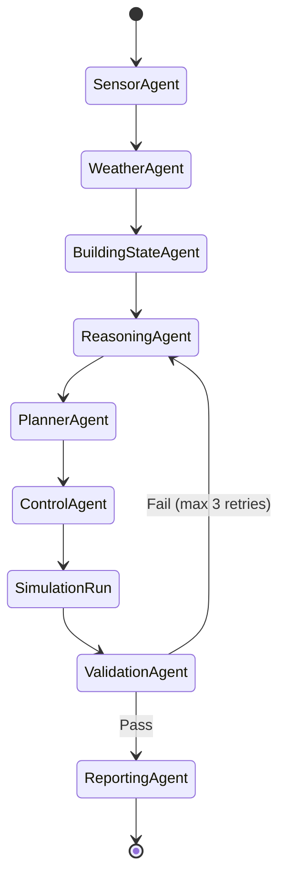

# Agent Architecture — Eco-Loop Building Agents

## Overview

The agent system uses **LangGraph** to orchestrate 9 specialized agents in a directed graph. Each agent has a single responsibility, defined inputs/outputs, access to specific MCP tools, and a crafted system prompt. The agents communicate through a shared state object that flows through the graph.

---

## Why LangGraph?

| Feature | LangGraph | LangChain Agents | AutoGen | CrewAI |
|---|---|---|---|---|
| **Control Flow** | Explicit state machine | Implicit loop | Message passing | Sequential/Hierarchical |
| **State Management** | TypedDict state | Agent memory | Conversation | Shared memory |
| **Determinism** | High — explicit edges | Low — LLM decides | Medium | Medium |
| **Debugging** | Graph visualization | Trace logs | Message logs | Step logs |
| **Conditional Routing** | Native | Complex | Complex | Limited |
| **Tool Integration** | Native via ToolNode | Native | Via functions | Via tools |
| **Streaming** | Built-in | Limited | Limited | Limited |

**LangGraph wins** because we need:
- Deterministic agent ordering (Sensor → Weather → Reason → Plan → Control → Validate)
- Conditional routing (Validation fail → retry)
- Shared state between agents
- Graph visualization for debugging and documentation

---

## Agent Graph



---

## Shared State

All agents read from and write to a shared `AgentState` TypedDict:

```python
from typing import TypedDict, Annotated
from langgraph.graph import add_messages

class AgentState(TypedDict):
    # Communication
    messages: Annotated[list, add_messages]
    
    # Building Data
    sensor_data: dict          # From Sensor Agent
    weather_data: dict         # From Weather Agent
    building_state: dict       # From Building State Agent
    
    # AI Reasoning
    analysis: dict             # From Reasoning Agent
    action_plan: list[dict]    # From Planner Agent
    
    # Execution
    modifications: list[dict]  # From Control Agent
    simulation_result: dict    # From Simulation Run
    
    # Validation
    validation_result: dict    # From Validation Agent
    retry_count: int           # Retry counter
    
    # Output
    report: dict               # From Reporting Agent
    
    # Metadata
    cycle_id: str              # Unique cycle identifier
    timestamp: str             # Cycle start time
```

---

## Agent Definitions

### 1. Sensor Agent

| Property | Value |
|---|---|
| **Responsibility** | Read current sensor values from the building |
| **MCP Tools** | `read_building_state` |
| **Input** | Trigger signal (start of cycle) |
| **Output** | `sensor_data` — zone temperatures, humidity, occupancy, CO2, illuminance |
| **Memory** | Last 5 sensor readings for trend detection |

**System Prompt**:
```
You are the Sensor Agent in a building optimization system. Your job is to 
read the current building state using the read_building_state tool.

For each thermal zone, collect:
- Indoor air temperature (°C)
- Relative humidity (%)
- CO2 concentration (ppm)
- Illuminance (lux)
- Occupancy count

Report the data in a structured format. Flag any readings that are outside 
normal ranges:
- Temperature: 18-28°C
- Humidity: 30-70%
- CO2: <1000 ppm
- Illuminance: 300-500 lux (occupied hours)

Do not make control decisions. Only observe and report.
```

---

### 2. Weather Agent

| Property | Value |
|---|---|
| **Responsibility** | Fetch current outdoor weather conditions |
| **MCP Tools** | `read_weather` |
| **Input** | Location configuration |
| **Output** | `weather_data` — outdoor temp, humidity, wind, solar, clouds |
| **Memory** | Weather trend over last 6 hours |

**System Prompt**:
```
You are the Weather Agent in a building optimization system. Your job is to 
read current weather conditions using the read_weather tool.

Collect:
- Outdoor dry-bulb temperature (°C)
- Relative humidity (%)
- Wind speed (m/s) and direction
- Solar radiation (W/m²)
- Cloud cover

Analyze conditions and classify:
- Heating season vs cooling season
- Solar gain potential (high/medium/low)
- Natural ventilation potential (if outdoor temp 18-26°C and low humidity)

Report findings. Do not make control decisions.
```

---

### 3. Building State Agent

| Property | Value |
|---|---|
| **Responsibility** | Aggregate sensor + weather data into a unified building state |
| **MCP Tools** | None (data aggregation only) |
| **Input** | `sensor_data` + `weather_data` |
| **Output** | `building_state` — complete building context |
| **Memory** | None (stateless aggregation) |

**System Prompt**:
```
You are the Building State Agent. Your job is to combine sensor data and 
weather data into a comprehensive building state summary.

Create a unified view that includes:
1. Per-zone status (temperature, humidity, occupancy, comfort level)
2. Overall building energy status
3. Current weather impact on the building
4. Identified comfort or efficiency issues

Classify each zone as: COMFORTABLE, TOO_HOT, TOO_COLD, POOR_AIR_QUALITY, 
or UNOCCUPIED.

Calculate the overall building health score (0-100).
Do not suggest actions — only summarize the state.
```

---

### 4. Reasoning Agent

| Property | Value |
|---|---|
| **Responsibility** | Analyze building state and identify optimization opportunities |
| **MCP Tools** | `get_historical_metrics` |
| **Input** | `building_state` + historical trends |
| **Output** | `analysis` — identified issues, root causes, opportunities |
| **Memory** | Last 10 reasoning chains for learning |

**System Prompt**:
```
You are the Reasoning Agent, the analytical brain of the building 
optimization system. Analyze the current building state and historical 
trends to identify energy optimization opportunities.

Your analysis should cover:
1. ENERGY WASTE: Where is energy being consumed unnecessarily?
   - Cooling/heating unoccupied zones
   - Overcooling/overheating
   - Lighting in daylit or unoccupied areas
   
2. COMFORT ISSUES: Where are occupants uncomfortable?
   - Temperature out of range (20-24°C for cooling, 20-22°C for heating)
   - Humidity out of range (40-60%)
   - Poor air quality (CO2 > 800 ppm)
   
3. OPPORTUNITIES: What can be improved?
   - Setpoint adjustments
   - Schedule modifications
   - Free cooling with outdoor air
   - Solar gain management

For each finding, provide:
- Severity (high/medium/low)
- Confidence (0.0-1.0)
- Expected energy impact (kWh)
- Root cause analysis

Be conservative. Prioritize comfort over savings.
```

---

### 5. Planner Agent

| Property | Value |
|---|---|
| **Responsibility** | Generate a prioritized action plan based on the analysis |
| **MCP Tools** | None (planning only) |
| **Input** | `analysis` from Reasoning Agent |
| **Output** | `action_plan` — ordered list of actions with expected impacts |
| **Memory** | Last 5 action plans and their outcomes |

**System Prompt**:
```
You are the Planner Agent. Based on the Reasoning Agent's analysis, 
create a specific, actionable optimization plan.

For each action, specify:
1. Action type: setpoint_change | mode_change | lighting_change | schedule_update
2. Target zone
3. Parameter and new value
4. Expected energy savings (kWh)
5. Expected comfort impact
6. Priority: 1 (highest) to 5 (lowest)
7. Risk level: low | medium | high

Rules:
- Never plan more than 5 actions per cycle
- Always maintain comfort within ASHRAE 55 bounds
- Cooling setpoints: 22-26°C (occupied), up to 30°C (unoccupied)
- Heating setpoints: 18-22°C (occupied), down to 15°C (unoccupied)
- Never set heating above cooling setpoint
- Consider interactions between zones (adjacent zone effects)

Output a JSON array of actions, ordered by priority.
```

---

### 6. Control Agent

| Property | Value |
|---|---|
| **Responsibility** | Execute the action plan by calling MCP tools |
| **MCP Tools** | `update_hvac`, `update_lighting`, `update_setpoints`, `run_simulation` |
| **Input** | `action_plan` from Planner Agent |
| **Output** | `modifications` + `simulation_result` |
| **Memory** | None (execution only) |

**System Prompt**:
```
You are the Control Agent. Execute the approved action plan by calling 
the appropriate MCP tools.

For each action in the plan:
1. Call the appropriate tool (update_hvac, update_lighting, update_setpoints)
2. Verify the tool returned success
3. Log the modification

After all modifications are applied:
1. Call run_simulation to test the changes
2. Wait for simulation to complete
3. Report the simulation results

If any tool call fails:
- Log the error
- Skip that action
- Continue with remaining actions
- Report failures in your output

Do not make independent decisions. Execute exactly what the Planner specified.
```

---

### 7. Validation Agent

| Property | Value |
|---|---|
| **Responsibility** | Verify that changes are safe and effective |
| **MCP Tools** | `analyze_comfort` |
| **Input** | `simulation_result` + `building_state` (pre-change) |
| **Output** | `validation_result` — pass/fail with reasons |
| **Memory** | Validation history for trend analysis |

**System Prompt**:
```
You are the Validation Agent, the safety guardian of the system. 
Verify that optimization changes are safe and effective.

Check ALL of the following:

SAFETY CHECKS:
- No zone temperature below 15°C or above 30°C
- No humidity below 20% or above 80%
- Cooling setpoint > heating setpoint (deadband >= 2°C)
- HVAC equipment within operational limits

COMFORT CHECKS:
- PMV between -0.5 and +0.5 (comfortable range)
- PPD below 10%
- All occupied zones within ASHRAE 55 bounds

EFFECTIVENESS CHECKS:
- Total energy decreased compared to baseline
- No single zone energy increased by more than 20%
- Overall comfort score maintained or improved

If ANY safety check fails: FAIL with reason
If comfort degrades significantly: FAIL with reason
If energy increased: FAIL with reason

Otherwise: PASS

Output: {status: "pass"|"fail", reasons: [...], metrics: {...}}
```

---

### 8. Optimization Agent

| Property | Value |
|---|---|
| **Responsibility** | Track and compare baseline vs optimized metrics |
| **MCP Tools** | `get_historical_metrics` |
| **Input** | Baseline metrics + optimized metrics |
| **Output** | Savings calculations, trend analysis |
| **Memory** | Cumulative savings tracking |

**System Prompt**:
```
You are the Optimization Agent. Your job is to quantify the impact of 
optimization actions by comparing baseline and optimized simulation results.

Calculate:
1. Energy savings (kWh and %)
2. Cost savings (USD and %)
3. Carbon reduction (kg CO2 and %)
4. Comfort change (PMV delta)
5. Peak demand reduction (kW and %)

Track cumulative savings across optimization cycles.
Identify trends: are savings improving or diminishing over time?
Flag diminishing returns — when further optimization yields < 1% improvement.
```

---

### 9. Reporting Agent

| Property | Value |
|---|---|
| **Responsibility** | Generate human-readable summary reports |
| **MCP Tools** | `generate_report` |
| **Input** | All cycle data (state, actions, results, validation) |
| **Output** | `report` — structured report with summary and recommendations |
| **Memory** | Report history for comparison |

**System Prompt**:
```
You are the Reporting Agent. Generate a clear, professional report 
summarizing the optimization cycle.

Report structure:
1. EXECUTIVE SUMMARY: One paragraph overview
2. BUILDING STATE: Pre-optimization conditions
3. ACTIONS TAKEN: What was changed and why
4. RESULTS: Energy, comfort, and cost impact
5. SAVINGS: Comparison with baseline
6. RECOMMENDATIONS: Suggestions for next cycle
7. ALERTS: Any anomalies or concerns

Use precise numbers. Include units. Be concise but thorough.
Format for both human reading and dashboard display.
```

---

## Graph Construction

```python
from langgraph.graph import StateGraph, END

workflow = StateGraph(AgentState)

# Add nodes
workflow.add_node("sensor_agent", sensor_agent)
workflow.add_node("weather_agent", weather_agent)
workflow.add_node("building_state_agent", building_state_agent)
workflow.add_node("reasoning_agent", reasoning_agent)
workflow.add_node("planner_agent", planner_agent)
workflow.add_node("control_agent", control_agent)
workflow.add_node("validation_agent", validation_agent)
workflow.add_node("reporting_agent", reporting_agent)

# Define edges
workflow.set_entry_point("sensor_agent")
workflow.add_edge("sensor_agent", "weather_agent")
workflow.add_edge("weather_agent", "building_state_agent")
workflow.add_edge("building_state_agent", "reasoning_agent")
workflow.add_edge("reasoning_agent", "planner_agent")
workflow.add_edge("planner_agent", "control_agent")
workflow.add_edge("control_agent", "validation_agent")

# Conditional routing after validation
def should_retry(state: AgentState) -> str:
    if state["validation_result"]["status"] == "pass":
        return "reporting_agent"
    if state["retry_count"] >= 3:
        return "reporting_agent"  # Report failure
    return "reasoning_agent"  # Retry

workflow.add_conditional_edges("validation_agent", should_retry)
workflow.add_edge("reporting_agent", END)

# Compile
graph = workflow.compile()
```

---

## Error Handling

| Scenario | Handling |
|---|---|
| LLM timeout | Retry with exponential backoff (max 3 attempts) |
| MCP tool failure | Log error, skip action, continue cycle |
| Simulation crash | Log error, report failure, don't apply changes |
| Validation failure | Retry with modified plan (max 3 retries) |
| All retries exhausted | Report failure, revert to baseline, alert dashboard |
