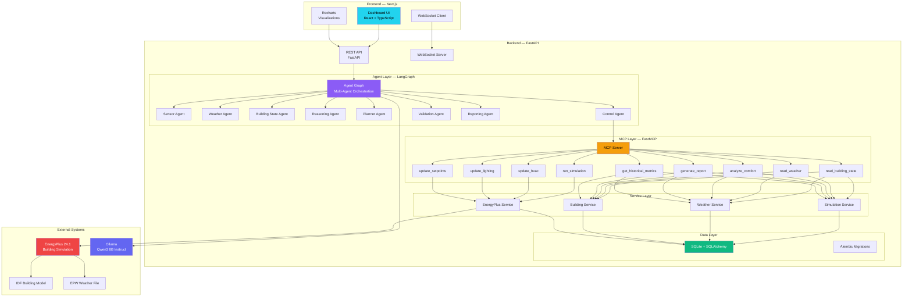
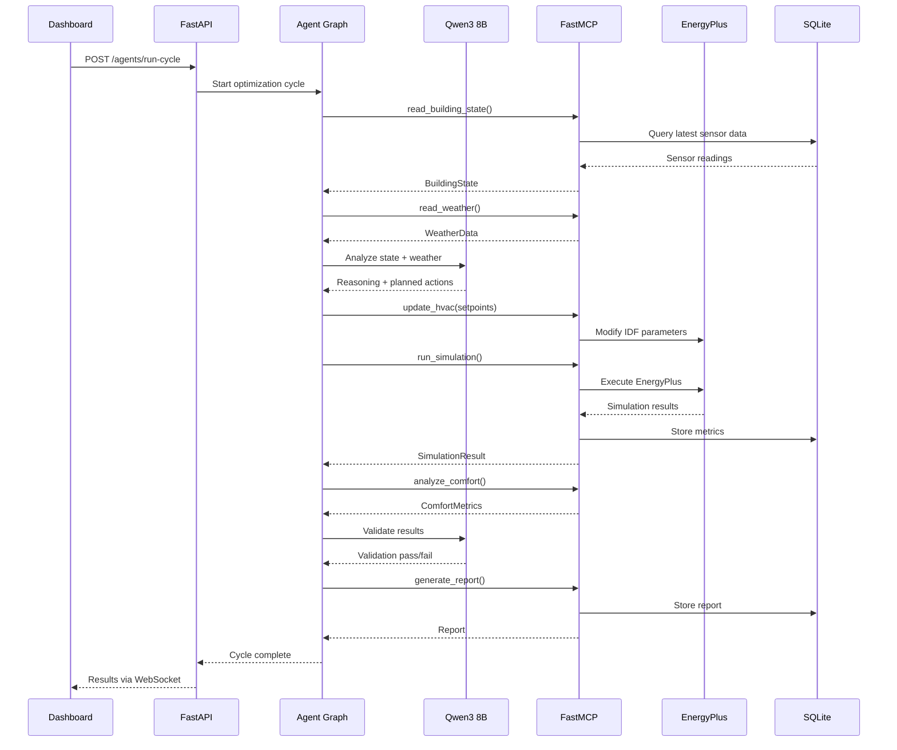
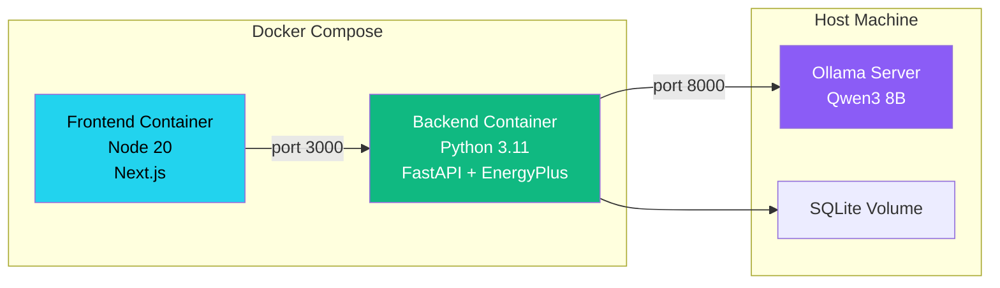

# System Architecture — Eco-Loop Building Agents

## Overview

Eco-Loop Building Agents is an autonomous closed-loop building optimization system that combines EnergyPlus energy simulation with AI-driven reasoning to minimize energy consumption while maintaining occupant comfort. The system uses a multi-agent architecture orchestrated by LangGraph, with tools exposed via the Model Context Protocol (MCP) using FastMCP, and powered by the Qwen3 8B Instruct open-source LLM running locally through Ollama.

---

## High-Level Architecture

---

## Data Flow Architecture

---

## Layer Responsibilities

### Frontend Layer
- **Purpose**: Real-time visualization and monitoring
- **Technology**: Next.js 14, React 18, TypeScript, TailwindCSS, shadcn/ui, Recharts, Framer Motion
- **Communication**: REST API for data queries, WebSocket for live updates
- **Key Feature**: Enterprise-grade dashboard with glassmorphism dark theme

### API Layer
- **Purpose**: HTTP and WebSocket gateway
- **Technology**: FastAPI with Pydantic validation
- **Features**: Auto-generated OpenAPI docs, CORS, request validation, error handling
- **Endpoints**: 22 REST endpoints + 1 WebSocket endpoint

### Agent Layer
- **Purpose**: Multi-agent AI orchestration
- **Technology**: LangGraph state machines
- **Features**: 9 specialized agents, shared state, conditional routing, memory
- **LLM**: Qwen3 8B Instruct via Ollama (ChatOllama wrapper)

### MCP Layer
- **Purpose**: Standardized tool interface for AI agents
- **Technology**: FastMCP (Python MCP server)
- **Features**: 9 tools with auto-generated JSON schemas, stdio transport
- **Bridge**: langchain-mcp-adapters for LangGraph integration

### Service Layer
- **Purpose**: Business logic and external system integration
- **Features**: EnergyPlus simulation management, weather data processing, building state aggregation

### Data Layer
- **Purpose**: Persistent storage
- **Technology**: SQLite + SQLAlchemy ORM + Alembic migrations
- **Tables**: 8 tables covering simulations, sensors, weather, HVAC, optimization, baseline, reasoning, reports

---

## Deployment Architecture

- **Backend**: Docker container with Python 3.11, FastAPI, EnergyPlus 24.1 installed
- **Frontend**: Docker container with Node.js 20, Next.js 14
- **Ollama**: Runs on host machine (GPU passthrough), accessed via HTTP on port 11434
- **Database**: SQLite file mounted as Docker volume for persistence

---

## Security & Configuration

- **Environment Variables**: All config via `.env` file (no hardcoded secrets)
- **CORS**: Configured for frontend origin only
- **No External APIs**: Fully offline operation (except optional weather API)
- **Local LLM**: No data leaves the machine — Ollama runs locally
