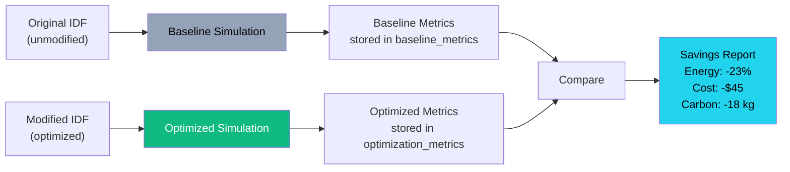

# Closed-Loop Optimization — Eco-Loop Building Agents

## Overview

The closed-loop optimization system is the core differentiator of Eco-Loop Building Agents. It implements an autonomous cycle where AI agents continuously observe building conditions, reason about inefficiencies, plan optimizations, execute changes, simulate outcomes, validate safety, and repeat — all without human intervention.

---

## The Closed-Loop Cycle

```mermaid
flowchart TD
    START(("🔄 Cycle Start")) --> OBSERVE

    subgraph "Phase 1: OBSERVE"
        OBSERVE["🔍 Read Sensors<br/>Sensor Agent → MCP read_building_state"]
        OBSERVE --> CONTEXT["🌤️ Read Weather<br/>Weather Agent → MCP read_weather"]
        CONTEXT --> AGGREGATE["📦 Aggregate State<br/>Building State Agent"]
    end

    AGGREGATE --> REASON

    subgraph "Phase 2: REASON"
        REASON["🧠 Analyze State<br/>Reasoning Agent + Historical Data"]
        REASON --> IDENTIFY["🔎 Identify Issues<br/>Energy waste, comfort problems"]
    end

    IDENTIFY --> PLAN

    subgraph "Phase 3: PLAN"
        PLAN["📋 Generate Actions<br/>Planner Agent"]
        PLAN --> PRIORITIZE["📊 Prioritize<br/>By impact & safety"]
    end

    PRIORITIZE --> EXECUTE

    subgraph "Phase 4: EXECUTE"
        EXECUTE["🔧 Apply Changes<br/>Control Agent → MCP update_hvac/lighting"]
        EXECUTE --> MODIFY["✏️ Modify IDF<br/>eppy library"]
    end

    MODIFY --> SIMULATE

    subgraph "Phase 5: SIMULATE"
        SIMULATE["⚡ Run EnergyPlus<br/>MCP run_simulation"]
        SIMULATE --> PARSE["📊 Parse Results<br/>CSV/SQL output parsing"]
    end

    PARSE --> VALIDATE

    subgraph "Phase 6: VALIDATE"
        VALIDATE["✅ Safety Check<br/>Validation Agent"]
        VALIDATE --> CHECK{"Pass?"}
    end

    CHECK -->|"✅ Yes"| STORE
    CHECK -->|"❌ No (< 3 retries)"| REASON
    CHECK -->|"❌ No (≥ 3 retries)"| ROLLBACK

    subgraph "Phase 7: STORE"
        STORE["💾 Log Everything<br/>Metrics, reasoning, actions → SQLite"]
        STORE --> COMPARE["📈 Compare<br/>Baseline vs Optimized"]
    end

    COMPARE --> REPORT

    subgraph "Phase 8: REPORT"
        REPORT["📋 Generate Report<br/>Reporting Agent"]
        REPORT --> NOTIFY["📡 Notify Dashboard<br/>WebSocket update"]
    end

    NOTIFY --> WAIT["⏳ Wait for Next Cycle<br/>(configurable interval)"]
    WAIT --> START

    ROLLBACK["⏪ Rollback<br/>Revert to baseline IDF"] --> STORE

    style START fill:#06b6d4,color:#fff
    style REASON fill:#8b5cf6,color:#fff
    style PLAN fill:#3b82f6,color:#fff
    style EXECUTE fill:#f59e0b,color:#000
    style SIMULATE fill:#10b981,color:#fff
    style VALIDATE fill:#ef4444,color:#fff
    style REPORT fill:#6366f1,color:#fff
    style ROLLBACK fill:#f97316,color:#fff
```



---

## Cycle Phases in Detail

### Phase 1: OBSERVE

**Goal**: Gather current building state data.

| Step | Agent | MCP Tool | Data Collected |
|---|---|---|---|
| Read sensors | Sensor Agent | `read_building_state` | Zone temps, humidity, CO2, illuminance, occupancy |
| Read weather | Weather Agent | `read_weather` | Outdoor temp, wind, solar, humidity |
| Aggregate | Building State Agent | — | Unified `BuildingState` object |

**Duration**: ~1-2 seconds

---

### Phase 2: REASON

**Goal**: Analyze the current state and identify optimization opportunities.

The Reasoning Agent:
1. Compares current state against comfort bounds (ASHRAE 55)
2. Queries historical data via `get_historical_metrics`
3. Identifies energy waste patterns
4. Calculates expected impact of potential changes
5. Produces a structured analysis with confidence scores

**Duration**: ~3-5 seconds (LLM inference)

**Example reasoning output**:
```json
{
    "findings": [
        {
            "type": "energy_waste",
            "zone": "Zone_3",
            "issue": "Overcooling by 1.5°C below setpoint",
            "severity": "medium",
            "confidence": 0.87,
            "expected_savings_kwh": 3.2,
            "root_cause": "Setpoint 22°C with zone at 20.5°C, occupancy low"
        }
    ]
}
```

---

### Phase 3: PLAN

**Goal**: Generate a specific, actionable optimization plan.

The Planner Agent:
1. Reviews the Reasoning Agent's analysis
2. Generates specific parameter changes
3. Prioritizes by impact and risk
4. Ensures all changes are within safety bounds
5. Limits to ≤5 actions per cycle

**Example action plan**:
```json
{
    "actions": [
        {
            "priority": 1,
            "type": "setpoint_change",
            "zone": "Zone_3",
            "parameter": "cooling_setpoint",
            "current_value": 22.0,
            "new_value": 23.5,
            "expected_savings_kwh": 3.2,
            "risk": "low"
        }
    ]
}
```

**Duration**: ~2-3 seconds (LLM inference)

---

### Phase 4: EXECUTE

**Goal**: Apply the planned changes to the building model.

The Control Agent:
1. Calls `update_hvac` / `update_lighting` / `update_setpoints` for each action
2. Each tool modifies the IDF file using `eppy`
3. Changes are logged with timestamps and reasons
4. Triggers `run_simulation` with the modified IDF

**Duration**: ~1 second (IDF modification)

---

### Phase 5: SIMULATE

**Goal**: Run EnergyPlus to evaluate the impact of changes.

1. EnergyPlus runs the modified IDF with the weather file
2. Simulation covers a design day or specified period
3. Output CSV/SQL files are parsed for metrics
4. Results are stored in the database

**Duration**: ~15-60 seconds (EnergyPlus simulation)

---

### Phase 6: VALIDATE

**Goal**: Ensure changes are safe and effective.

The Validation Agent checks:

| Check Category | Criteria | Threshold |
|---|---|---|
| **Safety** | Zone temp range | 15-30°C |
| **Safety** | Humidity range | 20-80% |
| **Safety** | Deadband | ≥ 2°C between heating/cooling |
| **Comfort** | PMV | -0.5 to +0.5 |
| **Comfort** | PPD | < 10% |
| **Effectiveness** | Total energy | Must decrease vs baseline |
| **Effectiveness** | Zone energy | No zone increases > 20% |

**On Failure**: Reverts changes, increments retry counter, sends state back to Reasoning Agent with failure reason for re-analysis.

**Duration**: ~2-3 seconds (LLM inference + comfort calculation)

---

### Phase 7: STORE

**Goal**: Persist all cycle data for analysis and dashboard display.

Data stored per cycle:

| Table | Records |
|---|---|
| `simulations` | 1 (optimized simulation record) |
| `sensor_readings` | 5 (one per zone) |
| `weather` | 1 (outdoor conditions) |
| `hvac_actions` | 1-5 (per action taken) |
| `optimization_metrics` | 1 (post-optimization metrics) |
| `llm_reasoning` | 5-9 (one per agent that ran) |
| `reports` | 1 (cycle summary) |

---

### Phase 8: REPORT

**Goal**: Generate a human-readable summary and notify the dashboard.

The Reporting Agent produces:
1. Executive summary of the cycle
2. Comparison: baseline vs optimized metrics
3. Savings: energy (kWh), cost ($), carbon (kg CO2)
4. Comfort impact: PMV/PPD changes
5. Recommendations for next cycle

Dashboard is notified via WebSocket with the complete report.

---

## Baseline Simulation

Before any optimization cycle, a **baseline simulation** runs with the original, unmodified IDF file. This establishes the "do nothing" energy consumption against which all optimizations are compared.



---

## Cycle Configuration

| Parameter | Default | Description |
|---|---|---|
| `CYCLE_INTERVAL_MINUTES` | 15 | Time between automatic cycles |
| `MAX_RETRIES` | 3 | Max validation retries per cycle |
| `MAX_ACTIONS_PER_CYCLE` | 5 | Max optimization actions per cycle |
| `SIMULATION_PERIOD` | "DesignDay" | EnergyPlus simulation period |
| `COMFORT_PRIORITY` | 0.6 | Weight for comfort vs energy (0-1) |
| `MIN_SAVINGS_THRESHOLD` | 0.01 | Minimum savings to proceed (1%) |

---

## Logging

Every cycle is fully logged:

```
[2026-07-26 10:00:00] CYCLE #12 STARTED
[2026-07-26 10:00:01] SENSOR: Read 5 zones — all nominal
[2026-07-26 10:00:02] WEATHER: 28.3°C, 45% RH, 620 W/m² solar
[2026-07-26 10:00:03] STATE: Building health score: 82/100
[2026-07-26 10:00:06] REASON: Found 2 issues (overcooling Zone 3, low occupancy Zone 4)
[2026-07-26 10:00:09] PLAN: 2 actions planned (raise SP Zone 3, reduce lighting Zone 4)
[2026-07-26 10:00:10] CONTROL: Applied 2 modifications to IDF
[2026-07-26 10:00:12] SIMULATE: EnergyPlus started
[2026-07-26 10:00:42] SIMULATE: Completed in 30.1s
[2026-07-26 10:00:45] VALIDATE: PASS — all checks passed
[2026-07-26 10:00:46] STORE: 14 records written to database
[2026-07-26 10:00:48] REPORT: Savings 3.2 kWh (2.1%), PMV 0.3→0.2
[2026-07-26 10:00:48] CYCLE #12 COMPLETED (48s total)
```
