# Database Design — Eco-Loop Building Agents

## Why SQLite?

SQLite is the ideal choice for this hackathon Proof-of-Concept:

| Advantage | Detail |
|---|---|
| **Zero Configuration** | No separate database server to install, configure, or maintain |
| **File-Based** | Entire database is a single `.db` file — easy to backup, share, or reset |
| **Performance** | Handles thousands of writes/second — more than sufficient for sensor readings at 1-15 minute intervals |
| **Python Native** | Built into Python's standard library; SQLAlchemy provides full ORM support |
| **Portable** | Works identically on Windows, Linux, and macOS |
| **Migration Path** | SQLAlchemy ORM abstracts the database — switching to PostgreSQL later requires only a connection string change |

### When to Upgrade to PostgreSQL
- Concurrent multi-user access (>10 simultaneous writers)
- Production deployment at building-portfolio scale
- Real-time streaming data from thousands of sensors

For a single-building PoC, SQLite is not just adequate — it's the correct choice.

---

## Database Schema

### Tables Overview

| Table | Purpose | Approximate Row Rate |
|---|---|---|
| `simulations` | Track each EnergyPlus simulation run | ~1-5 per optimization cycle |
| `sensor_readings` | Zone-level sensor data from simulations | ~5 per simulation (one per zone) |
| `weather` | Weather conditions per simulation timestep | ~1 per simulation |
| `hvac_actions` | HVAC control changes made by agents | ~1-3 per optimization cycle |
| `optimization_metrics` | Energy, comfort, cost metrics post-optimization | ~1 per simulation |
| `baseline_metrics` | Baseline (unoptimized) metrics for comparison | ~1 per baseline run |
| `llm_reasoning` | Agent reasoning chains, tool calls, confidence | ~5-9 per cycle (one per agent) |
| `reports` | Generated optimization summary reports | ~1 per cycle |

---

## Entity-Relationship Diagram

```mermaid
erDiagram
    SIMULATIONS {
        integer id PK "Auto-increment primary key"
        string simulation_id UK "UUID for external reference"
        string status "pending | running | completed | failed"
        string idf_path "Path to IDF file used"
        string epw_path "Path to EPW file used"
        datetime started_at "Simulation start time"
        datetime completed_at "Simulation end time"
        float duration_seconds "Wall-clock duration"
        string output_path "Path to output directory"
        text error_message "Error details if failed"
        boolean is_baseline "True if baseline simulation"
        datetime created_at "Record creation time"
    }
    
    SENSOR_READINGS {
        integer id PK "Auto-increment primary key"
        integer simulation_id FK "References simulations.id"
        datetime timestamp "Simulation timestep"
        string zone_name "Thermal zone identifier"
        float indoor_temp_c "Zone air temperature"
        float outdoor_temp_c "Outdoor dry bulb temp"
        float humidity_pct "Zone relative humidity"
        float co2_ppm "CO2 concentration"
        float illuminance_lux "Daylight illuminance"
        integer occupancy_count "Number of occupants"
        datetime created_at "Record creation time"
    }
    
    WEATHER {
        integer id PK "Auto-increment primary key"
        integer simulation_id FK "References simulations.id"
        datetime timestamp "Weather observation time"
        float dry_bulb_temp_c "Outdoor air temperature"
        float wet_bulb_temp_c "Wet bulb temperature"
        float rel_humidity_pct "Relative humidity"
        float wind_speed_ms "Wind speed"
        float wind_direction_deg "Wind direction"
        float solar_radiation_wm2 "Global horizontal radiation"
        string cloud_cover "Clear | Partly | Overcast"
        datetime created_at "Record creation time"
    }
    
    HVAC_ACTIONS {
        integer id PK "Auto-increment primary key"
        integer simulation_id FK "References simulations.id"
        datetime timestamp "When action was taken"
        string action_type "setpoint_change | mode_change | schedule_update"
        string zone_name "Target zone"
        float cooling_setpoint_c "New cooling setpoint"
        float heating_setpoint_c "New heating setpoint"
        float fan_speed_pct "Fan speed percentage"
        string mode "cooling | heating | auto | off"
        string initiated_by "Agent name that initiated action"
        text reason "Reasoning for the action"
        datetime created_at "Record creation time"
    }
    
    OPTIMIZATION_METRICS {
        integer id PK "Auto-increment primary key"
        integer simulation_id FK "References simulations.id"
        datetime timestamp "Metrics collection time"
        float total_energy_kwh "Total energy consumption"
        float hvac_energy_kwh "HVAC energy only"
        float lighting_energy_kwh "Lighting energy only"
        float cooling_energy_kwh "Cooling energy"
        float heating_energy_kwh "Heating energy"
        float peak_demand_kw "Peak electrical demand"
        float cost_usd "Estimated energy cost"
        float carbon_kg "Carbon emissions"
        float comfort_pmv "Predicted Mean Vote"
        float comfort_ppd "Predicted Percentage Dissatisfied"
        datetime created_at "Record creation time"
    }
    
    BASELINE_METRICS {
        integer id PK "Auto-increment primary key"
        integer simulation_id FK "References simulations.id"
        float total_energy_kwh "Baseline total energy"
        float hvac_energy_kwh "Baseline HVAC energy"
        float lighting_energy_kwh "Baseline lighting energy"
        float cost_usd "Baseline energy cost"
        float carbon_kg "Baseline carbon emissions"
        float comfort_pmv "Baseline comfort PMV"
        datetime created_at "Record creation time"
    }
    
    LLM_REASONING {
        integer id PK "Auto-increment primary key"
        integer simulation_id FK "References simulations.id"
        datetime timestamp "When reasoning occurred"
        string agent_name "Which agent produced this"
        text input_state "JSON of agent input state"
        text reasoning "Agent reasoning chain"
        text planned_actions "JSON of planned actions"
        text tool_calls "JSON of MCP tool calls made"
        float confidence "Agent confidence 0.0-1.0"
        float latency_ms "LLM response latency"
        integer token_count "Tokens used"
        datetime created_at "Record creation time"
    }
    
    REPORTS {
        integer id PK "Auto-increment primary key"
        integer simulation_id FK "References simulations.id"
        datetime created_at "Report generation time"
        string report_type "optimization | daily | alert | comparison"
        text summary "Human-readable summary"
        text recommendations "JSON list of recommendations"
        float energy_savings_pct "Energy savings percentage"
        float cost_savings_pct "Cost savings percentage"
        float carbon_reduction_pct "Carbon reduction percentage"
        float comfort_score "Overall comfort score 0-100"
    }

    SIMULATIONS ||--o{ SENSOR_READINGS : "produces"
    SIMULATIONS ||--o{ WEATHER : "records"
    SIMULATIONS ||--o{ HVAC_ACTIONS : "triggers"
    SIMULATIONS ||--o{ OPTIMIZATION_METRICS : "generates"
    SIMULATIONS ||--o| BASELINE_METRICS : "has baseline"
    SIMULATIONS ||--o{ LLM_REASONING : "logs"
    SIMULATIONS ||--o{ REPORTS : "produces"
```



---

## Migration Strategy

### Tools
- **SQLAlchemy 2.0**: ORM for Python model definitions
- **Alembic**: Database migration management

### Auto-Initialization
The database initializes automatically when the backend starts:

```python
# backend/app/database.py
from sqlalchemy import create_engine
from sqlalchemy.orm import sessionmaker

SQLALCHEMY_DATABASE_URL = "sqlite:///./ecoloop.db"

engine = create_engine(
    SQLALCHEMY_DATABASE_URL, 
    connect_args={"check_same_thread": False}
)

SessionLocal = sessionmaker(autocommit=False, autoflush=False, bind=engine)
```

### Migration Commands
```bash
# Create initial migration
alembic revision --autogenerate -m "initial schema"

# Apply migrations
alembic upgrade head

# Check current version
alembic current
```

---

## Indexes

Performance-critical indexes planned:

| Table | Column(s) | Purpose |
|---|---|---|
| `sensor_readings` | `simulation_id, timestamp` | Fast time-series queries |
| `sensor_readings` | `zone_name` | Zone-specific filtering |
| `weather` | `simulation_id, timestamp` | Weather history lookups |
| `hvac_actions` | `simulation_id, timestamp` | Action timeline |
| `optimization_metrics` | `simulation_id` | Metrics by simulation |
| `llm_reasoning` | `agent_name, timestamp` | Agent-specific reasoning history |
| `simulations` | `status, is_baseline` | Filter active/baseline runs |

---

## Data Retention

For the hackathon PoC, all data is retained indefinitely. In production, a retention policy would be:
- **Sensor readings**: 90 days detailed, then aggregate to hourly
- **LLM reasoning**: 30 days detailed
- **Reports**: Permanent
- **Simulations**: Permanent (with output files cleaned after 7 days)
