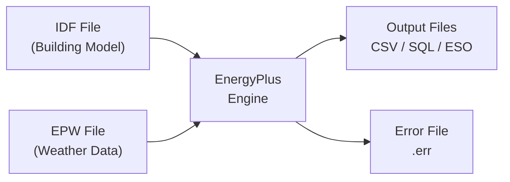
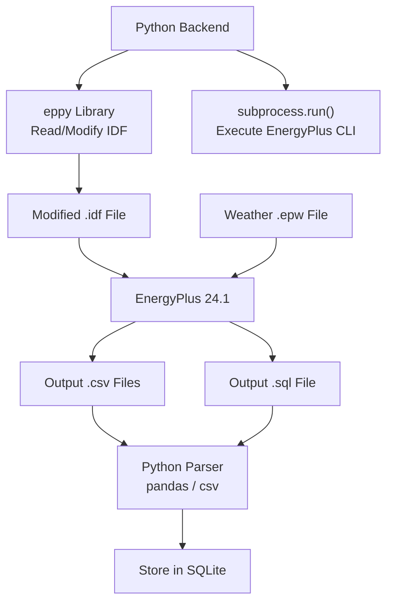

# EnergyPlus — Technical Documentation

## What is EnergyPlus?

EnergyPlus is the U.S. Department of Energy's (DOE) **open-source building energy simulation engine**. It models heating, cooling, lighting, ventilation, water usage, and other energy flows in buildings. It is the gold standard for building energy analysis, used by engineers, architects, and researchers worldwide.

- **Developer**: U.S. DOE / NREL (National Renewable Energy Laboratory)
- **License**: Open Source (BSD-like)
- **Current Version**: 24.1.0
- **Website**: [energyplus.net](https://energyplus.net)

### Key Capabilities
- Whole-building energy simulation
- Sub-hourly timesteps (down to 1 minute)
- HVAC system modeling (VAV, packaged units, chillers, boilers)
- Daylighting and lighting controls
- Occupancy schedules and internal loads
- Weather-driven simulation
- Output in CSV, SQL, JSON formats

---

## How EnergyPlus Works

### Simulation Process



1. **Input**: EnergyPlus takes two primary input files:
   - **IDF** (Input Data File): Defines the building geometry, materials, HVAC systems, schedules, and controls
   - **EPW** (EnergyPlus Weather): Hourly weather data for an entire year
2. **Simulation**: The engine solves heat balance equations for each zone at each timestep
3. **Output**: Results include energy consumption, zone temperatures, HVAC loads, comfort indices, and more

---

## IDF Files (Input Data File)

The IDF file is a **text-based** description of the entire building model. It uses a keyword-value format organized into objects.

### Structure
```
! Comment line
Building,
    SmallOffice,             !- Name
    0.0,                     !- North Axis (deg)
    City,                    !- Terrain
    0.04,                    !- Loads Convergence Tolerance
    0.4,                     !- Temperature Convergence Tolerance
    FullInteriorAndExterior, !- Solar Distribution
    25,                      !- Maximum Number of Warmup Days
    6;                       !- Minimum Number of Warmup Days

Zone,
    Core_ZN,                 !- Name
    0.0,                     !- Direction of Relative North
    0.0, 0.0, 0.0,          !- Origin X, Y, Z
    1,                       !- Type
    1,                       !- Multiplier
    autocalculate,           !- Ceiling Height
    autocalculate;           !- Volume
```

### Key IDF Objects We Modify
| Object | Purpose | What We Change |
|---|---|---|
| `HVACTemplate:Zone:*` | Zone HVAC configuration | Cooling/heating setpoints |
| `Schedule:Compact` | Time-based schedules | HVAC and lighting schedules |
| `Lights` | Lighting power density | Dimming levels |
| `ZoneControl:Thermostat` | Thermostat settings | Temperature setpoints |
| `SetpointManager:Scheduled` | Supply air temperature | Air handling setpoints |

### How We Modify IDF Files
We use the **`eppy`** Python library to programmatically read and modify IDF files:

```python
from eppy.modeleditor import IDF

# Load the IDF
IDF.setiddname("Energy+.idd")
idf = IDF("SmallOffice.idf")

# Modify a thermostat setpoint
for zone in idf.idfobjects["HVACTEMPLATE:ZONE:PTAC"]:
    zone.Cooling_Supply_Air_Temperature = 13.0
    zone.Heating_Supply_Air_Temperature = 50.0

# Save modified IDF
idf.save("SmallOffice_modified.idf")
```

---

## EPW Files (EnergyPlus Weather)

EPW files contain **hourly weather data for a full year** (8,760 hours). Each row represents one hour of data.

### Data Fields (Selected)
| Field | Unit | Description |
|---|---|---|
| Dry Bulb Temperature | °C | Air temperature |
| Dew Point Temperature | °C | Moisture content indicator |
| Relative Humidity | % | Moisture relative to saturation |
| Wind Speed | m/s | Horizontal wind speed |
| Wind Direction | degrees | Direction wind blows from |
| Global Horizontal Radiation | Wh/m² | Total solar radiation |
| Direct Normal Radiation | Wh/m² | Direct beam solar |
| Diffuse Horizontal Radiation | Wh/m² | Scattered solar |

### Selected Weather File
- **File**: `USA_IL_Chicago-OHare.Intl.AP.725300_TMY3.epw`
- **Source**: DOE/NREL TMY3 dataset via [climate.onebuilding.org](https://climate.onebuilding.org)
- **Why Chicago**: Standard benchmark location for EnergyPlus, used in DOE reference buildings, has hot summers and cold winters (tests both cooling and heating), widely used in academic research
- **How to Change**: Replace the EPW file in `energyplus/weather/` and update the `EPW_PATH` in `.env`

---

## FMU vs IDF — Do We Need FMU?

### What is FMU?
FMU (Functional Mock-up Unit) implements the FMI (Functional Mock-up Interface) standard for **co-simulation**. It allows EnergyPlus to exchange data with external controllers in real-time during a running simulation.

### Is FMU Required? **No.**

| Aspect | FMU (Co-Simulation) | Our Approach (Batch IDF) |
|---|---|---|
| **Interaction** | Real-time data exchange during simulation | Modify IDF → Run → Read outputs |
| **Complexity** | High (requires FMU export, BCVTB) | Low (subprocess + file I/O) |
| **Use Case** | Hardware-in-the-loop, real-time control | Optimization with offline reasoning |
| **Setup** | Requires BCVTB, FMPy, EnergyPlusToFMU | Just EnergyPlus + eppy |
| **Speed** | Slower (synchronization overhead) | Faster (batch processing) |
| **AI Integration** | Complex callback architecture | Simple: run → analyze → decide → repeat |

### Why IDF Batch Approach Is Sufficient

Our closed-loop works as follows:
1. Read current building state from last simulation
2. AI agent reasons about optimizations
3. Modify IDF parameters (setpoints, schedules) using `eppy`
4. Run EnergyPlus as a batch simulation
5. Parse output CSV/SQL files
6. Compare baseline vs optimized metrics
7. Repeat

This "modify → simulate → analyze → repeat" loop does **not** require real-time data exchange. FMU would add unnecessary complexity without benefit for this hackathon PoC.

---

## How Python Connects with EnergyPlus

### Approach: Subprocess + eppy



### Execution Command
```bash
energyplus -w weather.epw -d output_dir -r building.idf
```

### Output Files We Parse
| File | Content |
|---|---|
| `eplusout.csv` | Timestep-level zone data (temps, loads, energy) |
| `eplustbl.csv` | Summary tables (annual energy, peak loads) |
| `eplusout.sql` | SQLite database with all output variables |
| `eplusout.err` | Warnings and errors from simulation |

---

## Selected Building Model

### RefBldgSmallOfficeNew2004_Chicago.idf

- **Source**: DOE Commercial Reference Buildings, included with EnergyPlus 24.1
- **Building Type**: Small Office
- **Floor Area**: ~511 m² (5,500 ft²), single story
- **Zones**: 5 thermal zones (4 perimeter + 1 core)
- **HVAC**: Packaged Single Zone AC (PSZ-AC) — one unit per zone
- **Lighting**: Standard fluorescent, scheduled
- **Occupancy**: Weekday schedule 8am-5pm
- **Why Selected**:
  - Small enough for fast simulation (~30 seconds)
  - Has all key systems (HVAC, lighting, occupancy)
  - Well-documented and widely validated
  - Standard benchmark in building energy research
  - Demonstrates both heating and cooling with Chicago weather

---

## EnergyPlus Installation

### Version: 24.1.0

### Windows
```bash
# Download from https://energyplus.net/downloads
# Run the installer: EnergyPlus-24.1.0-xxxxx-Windows-x86_64.exe
# Default install: C:\EnergyPlusV24-1-0\

# Add to PATH:
set PATH=%PATH%;C:\EnergyPlusV24-1-0

# Verify:
energyplus --version
# Expected: EnergyPlus, Version 24.1.0-...
```

### Linux
```bash
# Download .sh installer
wget https://github.com/NREL/EnergyPlus/releases/download/v24.1.0/EnergyPlus-24.1.0-xxxxx-Linux-Ubuntu22.04-x86_64.sh
chmod +x EnergyPlus-24.1.0-*.sh
sudo ./EnergyPlus-24.1.0-*.sh

# Verify:
energyplus --version
```

### Python Dependencies
```bash
pip install eppy>=0.5.63
# pyenergyplus comes bundled with EnergyPlus installation
# Add EnergyPlus Python API to PYTHONPATH if needed:
# export PYTHONPATH=$PYTHONPATH:/usr/local/EnergyPlus-24-1-0
```

### Verification
```bash
# Run a test simulation
energyplus -w USA_IL_Chicago.epw -d test_output SmallOffice.idf

# Check for "EnergyPlus Completed Successfully" in test_output/eplusout.end
```

### Troubleshooting
| Issue | Solution |
|---|---|
| `energyplus` not found | Add installation directory to system PATH |
| IDD file not found | Set `ENERGYPLUS_DIR` environment variable |
| Simulation hangs | Check `.err` file for severe errors |
| Permission denied | Run with appropriate permissions, check output directory |
