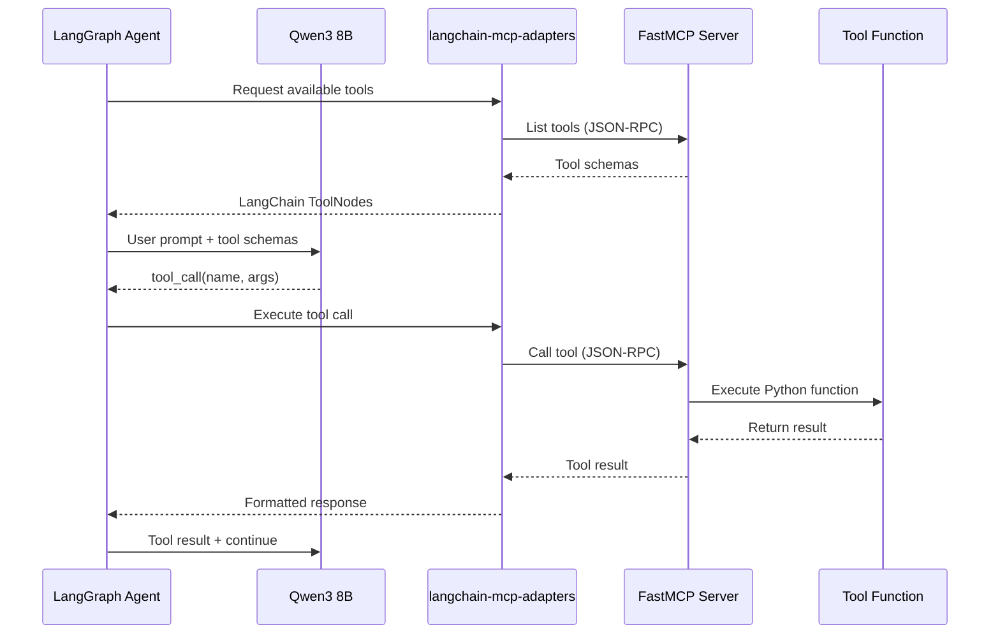

# MCP Architecture — Eco-Loop Building Agents

## What is MCP?

The **Model Context Protocol (MCP)** is an open standard (created by Anthropic, adopted broadly) that provides a universal interface for AI models to interact with external tools, data sources, and services. Think of it as a "USB-C for AI" — a standardized plug that lets any AI model connect to any tool server.

### Why MCP Matters

Without MCP, every LLM integration requires custom code:
- Custom function signatures for each tool
- Manual JSON schema definitions
- Framework-specific tool wrappers
- Tight coupling between agent code and tool implementations

With MCP:
- Tools are defined once on a **server**
- Any MCP-compatible **client** can discover and use them
- Schemas are auto-generated from type hints
- Tools are modular, testable, and reusable

---

## Why FastMCP?

We selected **FastMCP** as our MCP server implementation.

### Comparison

| Feature | FastMCP | Raw MCP SDK | Custom REST |
|---|---|---|---|
| Setup complexity | 1 decorator | 50+ lines boilerplate | 100+ lines |
| Schema generation | Auto from type hints | Manual JSON schema | Manual OpenAPI |
| Validation | Pydantic built-in | Manual | Manual |
| Transport | stdio, SSE, HTTP | stdio, SSE | HTTP only |
| LangGraph integration | Via langchain-mcp-adapters | Via langchain-mcp-adapters | Custom wrapper |
| Error handling | Built-in | Manual | Manual |
| Testing | Direct function calls | Complex setup | API testing |

### FastMCP Advantages
1. **Pythonic**: Define tools with `@mcp.tool()` decorator — just write normal Python functions
2. **Auto-Schema**: JSON schemas generated from Python type hints and docstrings
3. **Pydantic Integration**: Input validation is automatic
4. **Multiple Transports**: stdio for local agents, SSE/HTTP for remote access
5. **Production Quality**: Handles JSON-RPC 2.0 protocol, connection lifecycle, error serialization

---

## How Tool Calling Works



### Step-by-Step
1. **Discovery**: At startup, LangGraph agent connects to FastMCP server and fetches all available tool schemas
2. **Schema Injection**: Tool schemas are converted to LangChain `ToolNode` objects and passed to the LLM as available functions
3. **Decision**: The LLM decides which tool(s) to call based on the current state and prompt
4. **Execution**: The agent routes the tool call through the MCP adapter to the FastMCP server
5. **Result**: The tool executes, returns a result, which is fed back to the LLM for further reasoning

---

## Tool Inventory

### 1. `read_building_state`

**Purpose**: Returns the current state of the building — zone temperatures, humidity, occupancy, energy consumption.

```python
@mcp.tool()
def read_building_state(zone_name: str | None = None) -> dict:
    """Read the current building state from the latest simulation.
    
    Args:
        zone_name: Optional specific zone to query. 
                   If None, returns all zones.
    
    Returns:
        Dictionary with zone temperatures, humidity, 
        occupancy, and energy data.
    """
```

**Used by**: Sensor Agent, Building State Agent

---

### 2. `read_weather`

**Purpose**: Returns current outdoor weather conditions from the EPW file or weather service.

```python
@mcp.tool()
def read_weather(location: str | None = None) -> dict:
    """Read current weather conditions.
    
    Args:
        location: Optional location override.
                  Defaults to configured location.
    
    Returns:
        Dictionary with temperature, humidity, wind, 
        solar radiation, cloud cover.
    """
```

**Used by**: Weather Agent

---

### 3. `run_simulation`

**Purpose**: Triggers an EnergyPlus simulation with the current (possibly modified) IDF file.

```python
@mcp.tool()
def run_simulation(
    idf_path: str,
    epw_path: str,
    output_dir: str | None = None
) -> dict:
    """Run an EnergyPlus simulation.
    
    Args:
        idf_path: Path to the IDF building model file.
        epw_path: Path to the EPW weather file.
        output_dir: Optional output directory. 
                    Auto-generated if not provided.
    
    Returns:
        Dictionary with simulation_id, status, duration, 
        output_path, and summary metrics.
    """
```

**Used by**: Control Agent

---

### 4. `update_hvac`

**Purpose**: Modifies HVAC parameters in the IDF file (setpoints, mode, fan speed).

```python
@mcp.tool()
def update_hvac(
    zone: str,
    cooling_setpoint_c: float | None = None,
    heating_setpoint_c: float | None = None,
    mode: str | None = None,
    fan_speed_pct: float | None = None
) -> dict:
    """Update HVAC settings for a building zone.
    
    Args:
        zone: Target thermal zone name.
        cooling_setpoint_c: New cooling setpoint in Celsius (20-30).
        heating_setpoint_c: New heating setpoint in Celsius (15-25).
        mode: HVAC mode - 'cooling', 'heating', 'auto', 'off'.
        fan_speed_pct: Fan speed percentage (0-100).
    
    Returns:
        Dictionary confirming changes applied.
    """
```

**Used by**: Control Agent

---

### 5. `update_lighting`

**Purpose**: Adjusts lighting levels and schedules in the IDF file.

```python
@mcp.tool()
def update_lighting(
    zone: str,
    level_pct: float,
    schedule: str | None = None
) -> dict:
    """Update lighting settings for a building zone.
    
    Args:
        zone: Target thermal zone name.
        level_pct: Lighting level percentage (0-100).
        schedule: Optional schedule name to modify.
    
    Returns:
        Dictionary confirming changes applied.
    """
```

**Used by**: Control Agent

---

### 6. `update_setpoints`

**Purpose**: Batch update multiple setpoints across zones.

```python
@mcp.tool()
def update_setpoints(setpoints: dict) -> dict:
    """Batch update setpoints across multiple zones.
    
    Args:
        setpoints: Dictionary mapping zone names to 
                   their new setpoint configurations.
                   Example: {"Core_ZN": {"cooling": 24, "heating": 21}}
    
    Returns:
        Dictionary with success/failure per zone.
    """
```

**Used by**: Control Agent

---

### 7. `analyze_comfort`

**Purpose**: Calculate thermal comfort indices (PMV/PPD) for a zone.

```python
@mcp.tool()
def analyze_comfort(zone: str) -> dict:
    """Analyze thermal comfort for a building zone.
    
    Calculates PMV (Predicted Mean Vote) and 
    PPD (Predicted Percentage Dissatisfied) based on
    ASHRAE Standard 55.
    
    Args:
        zone: Thermal zone name to analyze.
    
    Returns:
        Dictionary with PMV (-3 to +3), PPD (%), 
        comfort category, and recommendations.
    """
```

**Used by**: Validation Agent

---

### 8. `generate_report`

**Purpose**: Creates a human-readable optimization summary report.

```python
@mcp.tool()
def generate_report(
    simulation_ids: list[int],
    report_type: str = "optimization"
) -> dict:
    """Generate an optimization report.
    
    Args:
        simulation_ids: List of simulation IDs to include.
        report_type: Type of report - 'optimization', 
                     'daily', 'comparison'.
    
    Returns:
        Dictionary with summary, recommendations, 
        savings percentages, and comfort score.
    """
```

**Used by**: Reporting Agent

---

### 9. `get_historical_metrics`

**Purpose**: Query past energy and comfort metrics from the database.

```python
@mcp.tool()
def get_historical_metrics(
    hours: int = 24,
    metric: str = "energy"
) -> dict:
    """Retrieve historical metrics from the database.
    
    Args:
        hours: Number of hours of history to retrieve.
        metric: Type of metric - 'energy', 'comfort', 
                'hvac', 'weather', 'all'.
    
    Returns:
        Dictionary with time-series data for the 
        requested metric type.
    """
```

**Used by**: Reasoning Agent

---

## LangGraph Integration

### How the Agent Discovers Tools

```python
from langchain_mcp_adapters.tools import load_mcp_tools
from mcp import ClientSession, StdioServerParameters
from mcp.client.stdio import stdio_client

# Define MCP server connection
server_params = StdioServerParameters(
    command="python",
    args=["backend/app/mcp/server.py"]
)

# Connect and load tools dynamically
async with stdio_client(server_params) as (read, write):
    async with ClientSession(read, write) as session:
        await session.initialize()
        
        # All 9 tools are automatically discovered
        tools = await load_mcp_tools(session)
        
        # Tools are now available as LangChain ToolNodes
        # for use in LangGraph agent graph
```

### FastMCP Server Setup

```python
from fastmcp import FastMCP

mcp = FastMCP("EcoLoop Building Tools")

@mcp.tool()
def read_building_state(zone_name: str | None = None) -> dict:
    """Read current building state from latest simulation."""
    # Implementation...
    pass

# ... register all 9 tools ...

if __name__ == "__main__":
    mcp.run(transport="stdio")
```

---

## Safety Constraints

All MCP tools enforce safety bounds:

| Parameter | Min | Max | Rationale |
|---|---|---|---|
| Cooling setpoint | 20°C | 30°C | Occupant comfort + equipment protection |
| Heating setpoint | 15°C | 25°C | Freeze protection + comfort |
| Fan speed | 0% | 100% | Equipment limits |
| Lighting level | 0% | 100% | Physical limits |
| Dead band | 2°C min | — | Prevent HVAC cycling |

The Validation Agent checks all modifications against these constraints before they are applied.
